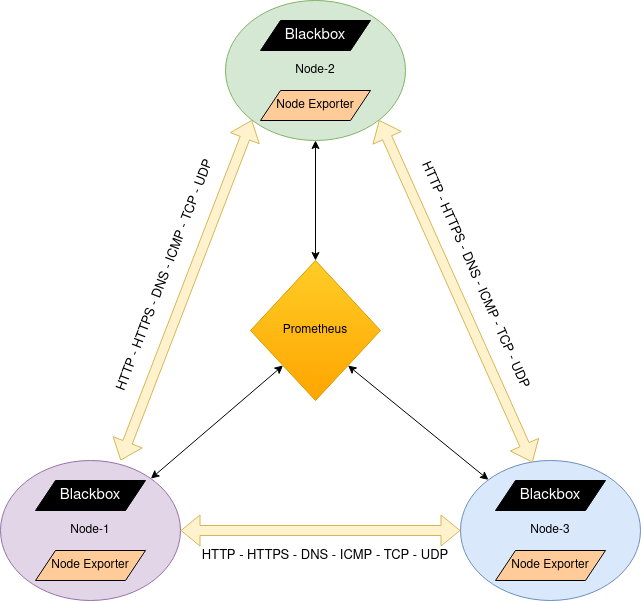

# Argos Panoptes
*Argus Panoptes* is a character in Greek mythology. He was a giant with 100 eyes on his body. **Panoptes** means all-seeing.

Argus was a servant of the goddess Hera and he made an excellent watchman because he never fell asleep.

This project will monitor network endpoints like **HTTP, HTTPS, DNS, TCP, ICMP, Network Traffic, Sockets** and more.

## Topology

This is how everything works:



Blackbox exporter and node exporter are present in each node. Each of them expose network stats and information of other nodes.
These metrics will monitor each node's network status from every other node's point of view. So we could call it a monitoring mesh.

## Gettings Started

This Ansible role will install and configure **Prometheus, Grafana, Blackbox exporter and Node exporter** on your target hosts.
Target hosts must have docker installed.
With this role, you can easily setup a network monitoring stack.

## Setup

Clone the repo:

```
git clone 'https://github.com/sabershahhoseini/argos-panoptes.git'
```

Edit inventory file at `./ansible/roles/panoptes/vars/inventory.yml`. Inventory file is pretty self-explanatory with help of comments.

Change directory to root directory of ansible:

```
cd ansible
```

Then, run command below:

```
ansible-playbook playbook/panoptes.yml -i ./roles/panoptes/vars/inventory.yml -u root
```

Then, grab Grafana dashboard json file at `./grafana-dashboard/argos-panoptes-dashboard.json` and import it to your Grafana server.
